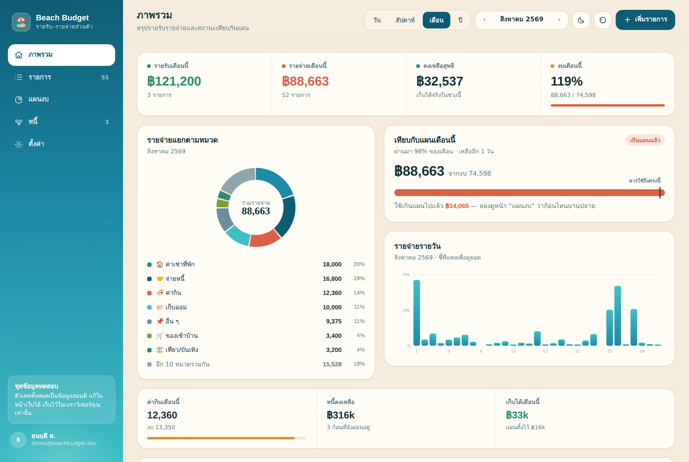
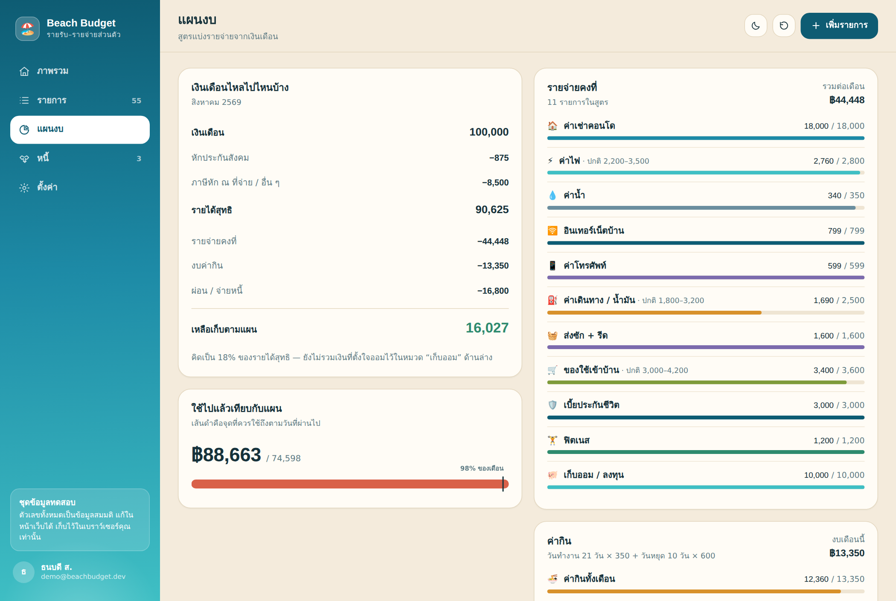
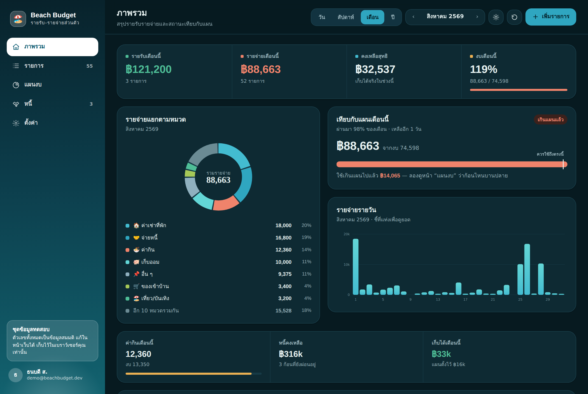

<div align="center">

# 🏖️ Beach Budget

**เว็บแอปบันทึกรายรับ–รายจ่ายส่วนตัว ธีมทรายครีม–ฟ้าน้ำทะเล**

เขียนด้วย HTML + CSS + JavaScript ล้วน ไม่มี framework ไม่มี build step
ข้อมูลทั้งหมดเป็นไฟล์ JSON ไฟล์เดียว

[](#-เปิดดูเดโม)
[](LICENSE)


</div>



---

## ✨ ทำอะไรได้บ้าง

| หน้า | รายละเอียด |
|---|---|
| **ภาพรวม** | ยอดรายรับ/รายจ่าย/คงเหลือ · โดนัทสัดส่วนหมวดหมู่ · กราฟแท่งรายวัน · แถบเทียบกับแผนพร้อมเส้นบอกว่า *ควรใช้ถึงไหนแล้ว* ตามวันที่ผ่านไปของเดือน |
| **รายการ** | ตารางทุกรายการ จัดกลุ่มตามวัน ค้นหา กรองตามประเภทและหมวด เรียงตามวันที่หรือจำนวนเงิน คลิกเพื่อดู/แก้/ลบ |
| **แผนงบ** | น้ำตกเงินเดือน: เงินเดือน → หักภาษี+ประกันสังคม → รายได้สุทธิ → แผนจ่าย → เหลือเก็บ พร้อมแถบเทียบ **แผน vs จ่ายจริง** รายก้อน |
| **หนี้** | แต่ละก้อนหนี้มียอดคงเหลือ ความคืบหน้า และจำนวนงวดที่เหลือ กด *บันทึกการจ่าย* แล้วยอดหนี้ลดอัตโนมัติ |
| **ตั้งค่า** | แก้เงินเดือน เงินหัก ค่ากินต่อวัน และทุกบรรทัดในสูตรแบ่งรายจ่าย — ทุกหน้าคำนวณใหม่ทันที |

**อย่างอื่นที่มี** — โหมดสว่าง/มืด (จำค่าที่เลือกไว้) · ใช้ได้บนมือถือ · เข้าถึงด้วยคีย์บอร์ดได้ · ดาวน์โหลดข้อมูลเป็น JSON · ไม่มี tracker ไม่มี cookie ไม่มีเซิร์ฟเวอร์

<table>
<tr>
<td width="50%"></td>
<td width="50%"></td>
</tr>
<tr><td align="center"><b>หน้าแผนงบ</b></td><td align="center"><b>โหมดมืด</b></td></tr>
</table>

---

## 🚀 เปิดดูเดโม

### รันบนเครื่อง

```bash
git clone https://github.com/<username>/beach-budget-web.git
cd beach-budget-web
python3 -m http.server 8000
# เปิด http://localhost:8000
```

> เปิดไฟล์ `index.html` ตรง ๆ ด้วย `file://` ไม่ได้ เพราะเบราว์เซอร์บล็อกการ `fetch` ไฟล์ JSON
> ถ้าไม่มี Python ใช้ `npx serve` หรือส่วนขยาย Live Server ของ VS Code ก็ได้

### ปล่อยขึ้น GitHub Pages

repo นี้มี workflow ให้แล้วที่ [`.github/workflows/deploy-pages.yml`](.github/workflows/deploy-pages.yml)

1. push โค้ดขึ้น branch `main`
2. ไปที่ **Settings → Pages → Source** เลือก **GitHub Actions**
3. รอ workflow เขียว แล้วเข้า `https://<username>.github.io/beach-budget-web/`

ไม่ต้อง build ไม่ต้องติดตั้งอะไร เพราะเป็น static site ล้วน

---

## 🗂️ โครงสร้างโปรเจกต์

```
beach-budget-web/
├── index.html              โครง HTML — แถบข้าง แถบบน ที่ว่างสำหรับเนื้อหา และโมดัล
├── assets/
│   ├── css/style.css       โทเคนสี ธีมสว่าง/มืด และสไตล์ทุกคอมโพเนนต์
│   └── js/app.js           ตรรกะทั้งหมด แบ่งเป็น 17 ส่วนตามคอมเมนต์
├── data/
│   └── seed.json           ⭐ ข้อมูลตั้งต้นทั้งหมดอยู่ที่นี่ไฟล์เดียว
├── docs/                   ภาพหน้าจอสำหรับ README
└── .github/workflows/      deploy ขึ้น Pages อัตโนมัติ
```

`assets/js/app.js` แบ่งเป็นส่วน ๆ ไว้ให้อ่านง่าย:

| ส่วน | เรื่อง |
|---|---|
| 1–2 | หมวดหมู่และไอคอน |
| 3 | ตัวช่วยเงิน/วันที่ + คลาสช่วงเวลา (`makeRange`, `shiftRange`, `dayCount`) |
| 4–5 | สถานะหน้าจอ และสูตรคำนวณงบทั้งหมด |
| 6 | กราฟ SVG ที่วาดเอง (โดนัท + แท่ง) |
| 8–12 | ฟังก์ชันเรนเดอร์ของแต่ละหน้า |
| 13–14 | โมดัลเพิ่ม/แก้ไข และตัวเรนเดอร์กลาง |
| 15–17 | ธีม เหตุการณ์ และการเริ่มทำงาน |

---

## 🧮 สูตรที่ใช้คำนวณ

```js
รายได้สุทธิ      = เงินเดือน − ประกันสังคม − ภาษีหัก ณ ที่จ่าย
งบค่ากินต่อเดือน  = (วันจันทร์–ศุกร์ × เรทวันทำงาน) + (วันเสาร์–อาทิตย์ × เรทวันหยุด)
แผนจ่ายทั้งเดือน  = รายจ่ายคงที่ทุกบรรทัด + งบค่ากิน + ยอดผ่อนหนี้ต่อเดือน
เหลือเก็บตามแผน   = รายได้สุทธิ − แผนจ่ายทั้งเดือน
ใช้ได้อีกวันละ     = (แผนจ่ายทั้งเดือน − ที่จ่ายไปแล้ว) ÷ วันที่เหลือในเดือน
```

จุดที่ต่างจากแอปงบทั่วไป: **งบค่ากินนับจากปฏิทินจริง** ไม่ได้ตีเหมาเดือนละเท่ากัน
เดือนที่มีวันหยุดเยอะงบค่ากินจะสูงขึ้นเองอัตโนมัติ

---

## 🎨 ระบบสี

พาเลตต์มาจากชายหาด และประกาศเป็น CSS custom property ทั้งหมดใน `:root`
โหมดมืดแค่นิยามโทเคนชุดเดิมใหม่ ไม่มีการเขียนสีตรง ๆ ในคอมโพเนนต์เลย

| บทบาท | สว่าง | มืด |
|---|---|---|
| พื้นหลัง | `#F4EBDC` ทราย | `#071A20` ทะเลกลางคืน |
| การ์ด | `#FFFCF6` เปลือกหอย | `#0E2A33` |
| แบรนด์ | `#0E5C73` → `#3FBFC4` | `#2FA6C0` → `#63D6D6` |
| รายรับ | `#2E8B6F` ใบปาล์ม | `#4FBE97` |
| รายจ่าย | `#D9614A` ปะการัง | `#F0836B` |
| เตือน | `#D8912B` พระอาทิตย์ตก | `#EFB253` |

ฟอนต์: **Bai Jamjuree** สำหรับหัวข้อและตัวเลข · **Noto Sans Thai** สำหรับเนื้อความ

---

## 📊 รูปแบบข้อมูล

ทุกอย่างอยู่ใน [`data/seed.json`](data/seed.json) ไฟล์เดียว แก้ไฟล์นี้แล้วรีเฟรชได้เลย

```jsonc
{
  "meta": {
    "demoToday": "2026-08-31",       // วันที่ที่แอปใช้เป็น "วันนี้" (เพื่อให้เดโมมีข้อมูลเต็มเดือน)
    "owner": { "name": "…", "email": "…" }
  },
  "settings": {
    "salary": 100000,                 // เงินเดือนก่อนหัก
    "socialSecurity": 875,
    "otherDeduction": 8500,           // ภาษีหัก ณ ที่จ่าย
    "foodWorkday": 350,               // ค่ากินต่อวันทำงาน
    "foodHoliday": 600,               // ค่ากินต่อวันหยุด
    "lines": [                        // สูตรแบ่งรายจ่ายคงที่
      { "id": "p_rent", "label": "ค่าเช่าคอนโด", "categoryId": "rent", "amount": 18000 },
      { "id": "p_elec", "label": "ค่าไฟ", "categoryId": "electric",
        "amount": 2800, "minAmount": 2200, "maxAmount": 3500 }
    ]
  },
  "debts": [
    { "id": "d1", "name": "ผ่อนรถ", "principal": 480000,
      "paid": 186400, "monthlyPlan": 9800, "note": "Honda City ผ่อน 48 งวด" }
  ],
  "transactions": [
    { "id": "t0001", "type": "expense", "amount": 350, "categoryId": "food",
      "date": "2026-08-14", "note": "ข้าวกลางวันออฟฟิศ", "slip": false, "debtId": null }
  ]
}
```

**ตัวเลขในเดโมเป็นข้อมูลทดสอบทั้งหมด** ไม่ใช่การเงินจริงของใคร
สมมติเป็นพนักงานประจำเงินเดือน 100,000 บาท อยู่คอนโด มีรถผ่อน และหนี้ กยศ. เหลืออีกงวดเดียว

การแก้ในหน้าเว็บจะถูกเก็บใน `localStorage` ของเบราว์เซอร์เท่านั้น
กดปุ่ม ↺ บนแถบบนเพื่อล้างกลับเป็นชุดตั้งต้น

---

## 🛠️ อยากเอาไปดัดแปลง

| อยากทำ | แก้ที่ไหน |
|---|---|
| เพิ่ม/เปลี่ยนหมวดหมู่ | `CATS` ส่วนที่ 1 ของ `app.js` แล้วเติม id ลงใน `EXPENSE_CATS` หรือ `INCOME_CATS` |
| เปลี่ยนสีทั้งเว็บ | โทเคนใน `:root` ของ `style.css` (มีคู่โหมดมืดอยู่ใต้ลงมา) |
| เปลี่ยนสกุลเงิน | `nf`, `money`, `baht` ส่วนที่ 3 ของ `app.js` |
| เปลี่ยน "วันนี้" เป็นวันจริง | ลบ `demoToday` ออกจาก `seed.json` แล้วแอปจะใช้วันปัจจุบันแทน |
| ต่อ backend จริง | แทนที่ `boot()` และ `save()` ส่วนที่ 4 และ 17 ด้วยการเรียก API ของคุณ |

---

## 📱 เวอร์ชันมือถือ

เว็บนี้เป็น prototype ของแอปมือถือที่เขียนด้วย **Flutter + Firebase**
(Auth ด้วย Google, Firestore, และ Storage สำหรับเก็บรูปสลิป) หน้าจอและสูตรคำนวณใช้ชุดเดียวกัน

---

## 📄 สัญญาอนุญาต

[MIT](LICENSE) — เอาไปใช้ ดัดแปลง หรือต่อยอดได้ตามสบาย
